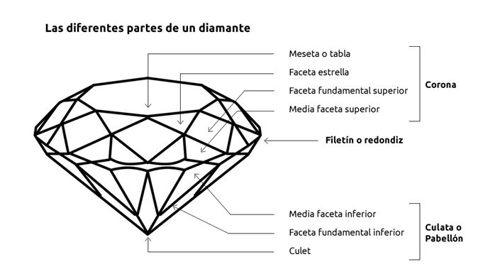

```{r setup, include=FALSE}
knitr::opts_chunk$set(echo = TRUE)
```

## 1. Descripción del dataset. ¿Por qué es importante y qué pregunta/problema pretende responder?

##### Los campos del conjunto de datos son los siguientes
###### x: El número de registro
###### carat: Peso en kilates del diamante
###### cut: La calidad del corte del diamante
###### color: El color del diamante
###### clarity: Califica la apariencia visual de cada diamante
###### depth: La altura de un diamante, medida desde el culet, o base, hasta la tabla, o tope superior, divido por su diámetro medio (z / media(x, y))
###### table: El ancho de la tabla del diamante expresado como un porcentaje de su diámetro medio
###### price: El precio del diamante
###### x: longitud del diamante en mm
###### y: ancho del diamante en mm
###### z: profundidad del diamante en mm


A continuación, para mayor claridad, se incluyen las partes del diamante




## 2. Integración y selección de los datos de interés a analizar. 

```{r,eval=TRUE,echo=TRUE}
# Lectura de datos
diamonds_df <- read.csv("diamonds.csv", header = TRUE, sep=",", dec = ".")
#Ejecutando la funcion summary sobre el dataframe, nos mostrará un resumen de cada variable
summary(diamonds_df)
str(diamonds_df)
```
##### La lectura del fichero y el resumen de estadísticos de las variables nos muestra que el conjunto de datos consta de 53940 registros y 11 variables o columnas.
##### La función de importación del fichero csv ha asignado correctamente cada variable con su tipo de datos, los que tienen decimales son números, los que son cualitativos se han importado como factores y el precio es un número entero
##### De todas ellas la variable X no aporta nada, ya que contiene el número o identificador de registro, por ello, la eliminaremos del conjunto de datos
```{r,eval=TRUE,echo=TRUE}
diamonds_df<-diamonds_df[,-1]
```

Consideramos que necesitamos una variable que contenga el volumen de los diamantes, basándonos en sus medidas x, y, z
```{r,eval=TRUE,echo=TRUE}
volume<-diamonds_df$x*diamonds_df$y*diamonds_df$z
diamonds_df<-cbind(diamonds_df,volume)
```


## 3. Limpieza de los datos.

### 3.1. ¿Los datos contienen ceros o elementos vacíos? ¿Cómo gestionarías cada uno de estos casos? 
```{r,eval=TRUE,echo=TRUE}
#Comprobamos si hay registros con elementos vacíos o NA
sapply(diamonds_df, anyNA)
```
###### Hemos comprobado que no hay ningún registro con elementos vacíos

```{r,eval=TRUE,echo=TRUE}
#Comprobamos si hay registros que contienen ceros
sapply(diamonds_df, function(x) any(x==0))
```
###### Hemos comprobado que las variables volumen, x, y, z contienen ceros

###### Un diamante es un objeto que debe tener ancho, altura y profundidad, por lo tanto, asumimos que si alguna de estas variables son 0, es que no se ha medido o hay un error en los datos. 
###### Este tipo de problemas, tiene 2 soluciones: Podríamos eliminar estos registros o calcular un nuevo valor según la semejanza de este registro con otros dentro del mismo conjunto de datos.
###### Creemos que eliminar estos registros limitaría nuestro conjunto de datos y ocultaría información que queremos analizar, por ello, imputaremos los valores perdidos a través del modelo basado en los k-vecinos más cercanos. 
###### El modelo Knn encuentra los k vecinos más cercanos según la semejanza de los registros perdidos con los demás registros del juego de datos
###### Solo imputaremos el valor en las variables x, y, z, no tiene sentido aplicar este método a la variable volumen, ya que, es un campo calculado, lo que haremos será que después de calcular los nuevos valores, volveremos a calcular el volumen
```{r,eval=TRUE,echo=TRUE}
suppressWarnings(suppressMessages(library(VIM)))
library(VIM)
#Miramos que registros contienen ceros
indicesx <-which(diamonds_df$x==0)
indicesy <-which(diamonds_df$y==0)
indicesz <-which(diamonds_df$z==0)
#Asignamos el valor de NA a todos los campos que contienen ceros
diamonds_df[indicesx,"x"]<-NA
diamonds_df[indicesy,"y"]<-NA
diamonds_df[indicesz,"z"]<-NA
```
###### Miramos el estado de los registros que contienen ceros en la variable x, antes de la imputación
```{r,eval=TRUE,echo=TRUE}
diamonds_df[indicesx,]
kNNx<-kNN(diamonds_df[,c("cut","color","clarity","depth","table","price","x","y","z")], variable="x",k=3)
diamonds_df[indicesx,"x"]<-kNNx[indicesx,"x"]
```
###### Después de la imputación en la variable x
```{r,eval=TRUE,echo=TRUE}
diamonds_df[indicesx,]
```
###### Miramos el estado de los registros que contienen ceros en la variable y, antes de la imputación
```{r,eval=TRUE,echo=TRUE}
diamonds_df[indicesy,]
kNNy<-kNN(diamonds_df[,c("cut","color","clarity","depth","table","price","x","y","z")], variable="y",k=3)
diamonds_df[indicesy,"y"]<-kNNy[indicesy,"y"]
```
###### Después de la imputación en la variable y
```{r,eval=TRUE,echo=TRUE}
diamonds_df[indicesy,]
```
###### Miramos el estado de los registros que contienen ceros en la variable z, antes de la imputación
```{r,eval=TRUE,echo=TRUE}
diamonds_df[indicesz,]
kNNz<-kNN(diamonds_df[,c("cut","color","clarity","depth","table","price","x","y","z")], variable="z",k=3)
diamonds_df[indicesz,"z"]<-kNNz[indicesz,"z"]
```
###### Después de la imputación en la variable z
```{r,eval=TRUE,echo=TRUE}
diamonds_df[indicesz,]
```
###### calculamos nuevamente la variable volumen ya que, esta depende de los valores de x, y, z
```{r,eval=TRUE,echo=TRUE}
diamonds_df$volume<-diamonds_df$x*diamonds_df$y*diamonds_df$z
```
###### Finalmente, volvemos a comprobar si hay registros ceros o elementos vacíos
```{r,eval=TRUE,echo=TRUE}
#Comprobamos si hay registros con elementos vacíos o NA
sapply(diamonds_df, anyNA)
```
```{r,eval=TRUE,echo=TRUE}
#Comprobamos si hay registros que contienen ceros
sapply(diamonds_df, function(x) any(x==0))
```
###### Efectivamente, ya no hay ningún valor cero ni elementos vacío

### 3.2 Identificación y tratamiento de valores extremos. 

###### En primer lugar, en esta categoría analizaremos sólo los valores numéricos, para ello, vamos a realizar representaciones de tipo caja de cada una de las variables.

```{r,eval=TRUE,echo=TRUE}
#Representamos cada variable
boxplot(diamonds_df$carat, main="Peso en Kilates", xlab="peso", ylab="kilates")
boxplot(diamonds_df$depth, main="Altura del diamante", xlab="altura", ylab="z / media(x, y)")
boxplot(diamonds_df$table, main="Ancho de la tabla", xlab="tabla", ylab="% respecto al diámetro medio")
boxplot(diamonds_df$price, main="Precio", xlab="precio", ylab="USD")
boxplot(diamonds_df$x, main="Longitud", xlab="longitud", ylab="mm")
boxplot(diamonds_df$y, main="Ancho", xlab="ancho", ylab="mm")
boxplot(diamonds_df$z, main="Profundidad", xlab="profundidad", ylab="mm")
boxplot(diamonds_df$volume, main="Volumen", xlab="volumen", ylab="mm^3")
```

###### Observando los datos, vemos que existen datos que, claramente, suponen valores extremos que no difieren bastante de la media de la muestra, analizamos caso a caso.


## 4. Análisis de los datos.
### 4.1. Selección de los grupos de datos que se quieren analizar/comparar (planificación de los análisis a aplicar). 

### 4.2. Comprobación de la normalidad y homogeneidad de la varianza. 

En primer lugar, se realiza un estudio sobre la normalidad de las variables precio, altura, tabla, x, y, z y volumen.

Se realizará un estudio visual y, a continuación, un test Shapiro (considerado de los más potentes para el contraste de la normalidad).

>En el estudio visual se utilizarán histogramas de frecuencias relativas con curva de normalidad superpuesta

```{r,eval=TRUE,echo=TRUE}
#Variable peso
hist(diamonds_df$carat, main= "Peso del diamante", freq = FALSE, xlab = "Kilates", col = "dark green", border="white")
curve(dnorm(x, mean=mean(diamonds_df$carat), sd=sd(diamonds_df$carat)), add=TRUE, col="red", lwd=3)

#Variable precio
hist(diamonds_df$price, main= "Precio del diamante", freq = FALSE, xlab = "Precio USD", col = "dark green", border="white")

#Variable altura
hist(diamonds_df$depth, main= "Altura del diamante", freq = FALSE, xlab = "z / media(x, y)", col = "dark green", border="white")
curve(dnorm(x, mean=mean(diamonds_df$depth), sd=sd(diamonds_df$depth)), add=TRUE, col="red", lwd=3)

#Variable ancho
hist(diamonds_df$table, main= "Ancho del diamante", freq = FALSE, xlab = "% respecto al diámetro medio", col = "dark green", border="white")
curve(dnorm(x, mean=mean(diamonds_df$table), sd=sd(diamonds_df$table)), add=TRUE, col="red", lwd=3)

#Variable "x"
hist(diamonds_df$x, main= "Longitud", freq = FALSE, xlab = "mm", col = "dark green", border="white")

#Variable "y"
hist(diamonds_df$y, main= "Ancho", freq = FALSE, xlab = "mm", col = "dark green", border="white")
curve(dnorm(x, mean=mean(diamonds_df$y), sd=sd(diamonds_df$y)), add=TRUE, col="red", lwd=3)

#Variable "z"
hist(diamonds_df$z, main= "Profundidad", freq = FALSE, xlab = "mm", col = "dark green", border="white")
curve(dnorm(x, mean=mean(diamonds_df$z), sd=sd(diamonds_df$z)), add=TRUE, col="red", lwd=3)

#Volumen
hist(diamonds_df$volume, main= "Volumen", freq = FALSE, xlab = "mm^3", col = "dark green", border="white")
curve(dnorm(x, mean=mean(diamonds_df$volume), sd=sd(diamonds_df$volume)), add=TRUE, col="red", lwd=3)

```

Vemos que en el caso del precio seguiría una distribución exponencial negativa, por otra parte, la longitud no seguiría ninguna distribución apreciable.

Vamos a realizar el Test Shapiro a las variables que podrían asemejarse a una distribución normal, si atendemos a su gráfico.

```{r,eval=TRUE,echo=TRUE}
shapiro.test(diamonds_df$carat[1:5000])
shapiro.test(diamonds_df$depth[1:5000])
shapiro.test(diamonds_df$table[1:5000])
shapiro.test(diamonds_df$y[1:5000])
shapiro.test(diamonds_df$z[1:5000])
shapiro.test(diamonds_df$volume[1:5000])
```

A continuación, vamos a comprobar si la varianza es homogénea, es decir, cumple con la homocedasticidad, para ello, ya que las muestras nos son normales, vamos a utilizar el test de Fligner-Killeen


Vamos a realizar un estudio de normalidad sobre la variable corte, para ello vamos a asignar un valor numérico a cada uno de los niveles de la variable categorica "cut".

```{r}
table(diamonds_df$cut)

```

Siendo estos valores:

* Fair: 1
* Good: 2
* Very Good: 3
* Premium: 4
* Ideal: 5

```{r,eval=TRUE,echo=TRUE}
level.cut<-diamonds_df$cut
level.cut[level.cut="Fair"]<-"1"
level.cut[level.cut="Good"]<-"2"
level.cut[level.cut="Very Good"]<-"3"
level.cut[level.cut="Premium"]<-"4"
level.cut[level.cut="Ideal"]<-"5"
level.cut<-as.numeric(level.cut)

#Variable corte
hist(level.cut, main= "Calidad del corte", freq = FALSE, xlab = "Nivel de calidad", col = "dark green", border="white")
#curve(dnorm(x, mean=mean(level.cut), sd=sd(level.cut)), add=TRUE, col="red", lwd=3)

#Test Shapiro
shapiro.test(level.cut[1:5000])


```


### 4.3.  Aplicación de pruebas estadísticas para comparar los grupos de datos. En función de los datos y el objetivo del estudio, aplicar pruebas de contraste de hipótesis, correlaciones,  regresiones,  etc.  Aplicar  al  menos  tres  métodos  de  análisis diferentes. 


#### 4.3.1. Análisis de correlaciones

A continuación, vamos a realizar los análisis de correlaciones, para ello, vamos a utilizar el precio como principal indicador, correlacionando éste con todas las variables, numéricas y categoricas, para las numéricas realizaremos un análisis de correlación Pearson, para las categóricas realizaremos el test chi-square

__Variables Numéricas__

* Precio
* Peso 
* Profundidad
* Tabla
* Volumen

```{r}

library (reshape2, warn.conflicts = FALSE)
library(ggplot2)

#Creamos una matriz de correlación con los datos descritos
corr.mat<-round(cor(diamonds_df[,c(7,1,5,6,11)], method = "pearson"),2)

#Visualizamos los datos mediante un mapa de calor
corr.mat[lower.tri(corr.mat)]<- NA

m.corr.mat<-melt(corr.mat, na.rm=TRUE)

# Fuente: http://www.sthda.com/english/wiki/ggplot2-quick-correlation-matrix-heatmap-r-software-and-data-visualization
ggplot(data = m.corr.mat, aes(Var2, Var1, fill = value))+
 geom_tile(color = "white")+
 scale_fill_gradient2(low = "blue", high = "red", mid = "white", 
   midpoint = 0, limit = c(-1,1), space = "Lab", 
   name="Pearson\nCorrelation") +
  theme_minimal()+ 
 theme(axis.text.x = element_text(angle = 45, vjust = 1, 
    size = 12, hjust = 1))+
 coord_fixed()
```

Vemos que las variables más correlacionadas con el precio son el peso en kilates y el volumen del diamante.

Para estas dos variables, vamos a estudiar una a una su índice de correlación:

```{r}
library(psych)
pairs.panels(diamonds_df[,c(7,11)], ellipses = FALSE, lm=TRUE, method = "pearson")
pairs.panels(diamonds_df[,c(7,1)], ellipses = FALSE, lm=TRUE, method = "pearson")
```

Vemos que la correlación entre el Precio y el Peso, y entre el Precio y su volumen es bastante alta.

__Variables Categóricas__

A continuación, vamos a realizar un estudio de correlación para variables categóricas utilizando el test chi-square, para ello, en primer lugar, tenemos que crear una tabla de frecuencias de las variables y luego estudiar su relación mediante dicho test.

Pero antes, debemos discretizar la variable precio. lo haremos mediante divisiones en función de la frecuencia, para tener grupos lo más parecidos posibles, tendremos 4 niveles de precio:

* Primer cuartil: Bajo
* Segundo cuartil: Medio-bajo
* Tercer cuartil: Medio-alto
* Tercer cuartil: Alto

```{r}
suppressWarnings(suppressMessages(library(arules)))
library(arules)
cuartil.price<-discretize(diamonds_df$price, method="frequency",breaks=4,labels=c("Bajo","Medio-Bajo","Medio-Alto","Alto"))

table(cuartil.price)


```

Una vez realizada la discretización, procedemos a crear las tablas de contingencia para ver la relación entre el Precio y las variables cualitativas.

```{r}
#Variable "cut"
tbl.cut<-table(cuartil.price,diamonds_df$cut)
tbl.cut

#Variable "Color"
tbl.color<-table(cuartil.price,diamonds_df$color)
tbl.color

#Variable "Clarity"
tbl.clarity<-table(cuartil.price,diamonds_df$clarity)
tbl.clarity


```

Donde, de manera visual, parece dificil establecer relaciones entre el Precio y el resto de las variables.

A continuación, realizamos los tests chi-square para cada una de las tablas, con el fin de comprobar si existe relación.

```{r}
chisq.test(cuartil.price, diamonds_df$cut)
#chisq.test(tbl.clarity)
#chisq.test(tbl.color)
```

Alternativa utilizando el método V de Cramer, este método da un valor entre 0 y 1, donde 0 es nada relacionado y 1 totalmente relacionado

```{r, warning=FALSE}
suppressWarnings(suppressMessages(library(rcompanion)))
library(rcompanion)
cramerV(cuartil.price, diamonds_df$cut)
cramerV(cuartil.price, diamonds_df$color)
cramerV(cuartil.price, diamonds_df$clarity)
```
#### 4.3.2. Contraste de Hipótesis

#### 4.3.3. Regrestiones


Y vemos que no podemos establecer una relación directa entre el Precio y las variables de Color, Corte y Claridad.

## 5. Representación de los resultados a partir de tablas y gráficas. 

## 6. Resolución  del  problema.  A  partir  de  los  resultados  obtenidos,  ¿cuáles  son  las conclusiones? ¿Los resultados permiten responder al problema? 


 


